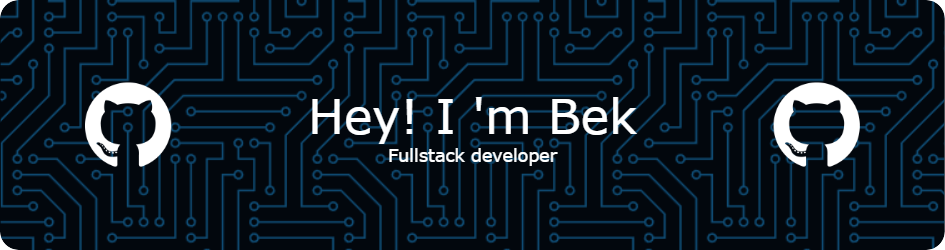

### 🤵 About Me :

I'm an enthusiastic student from Kazakhstan 🔆

- 👦 He/Him.
- 💻 Loves programming
- 👒 One Piece Fan

---

### 🛠 &nbsp;Languages and Tools:

&nbsp;
&nbsp;
&nbsp;
&nbsp;
&nbsp;
&nbsp;
&nbsp;
&nbsp;
&nbsp;
&nbsp;
&nbsp;

### 🌱 Plans :

&nbsp;
&nbsp;
&nbsp;
&nbsp;
&nbsp;
&nbsp;

---

### 🧨 My Stats :

### 🔗 Links :
https://links-mugid.vercel.app  

